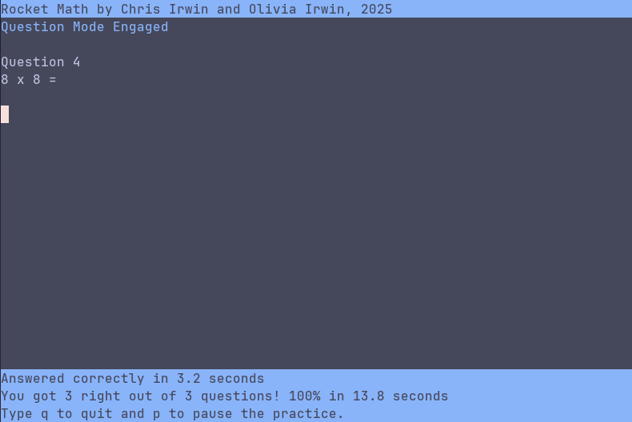

## Rocket Math



A curses based terminal program to practice addition, subtraction, multiplication and division.


#### How to run
```
❯ ./rocket-math.py -h
usage: rocket-math.py [-h] [-s] operation number

positional arguments:
  operation      operation (a,s,m,d)
  number         number of questions/seconds

options:
  -h, --help     show this help message and exit
  -s, --seconds  fixed seconds mode
```
#### Examples

For 50 multiplication questions:

`❯ ./rocket-math.py m 50`

For 60 seconds of as many addition questions as you can answer:

`❯ ./rocket-math.py -s a 60`

